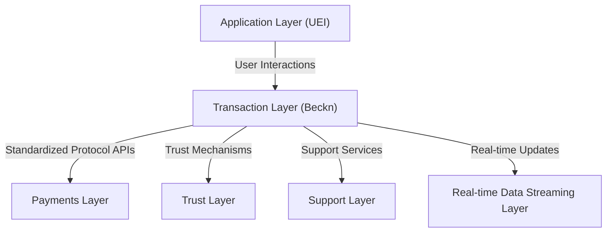
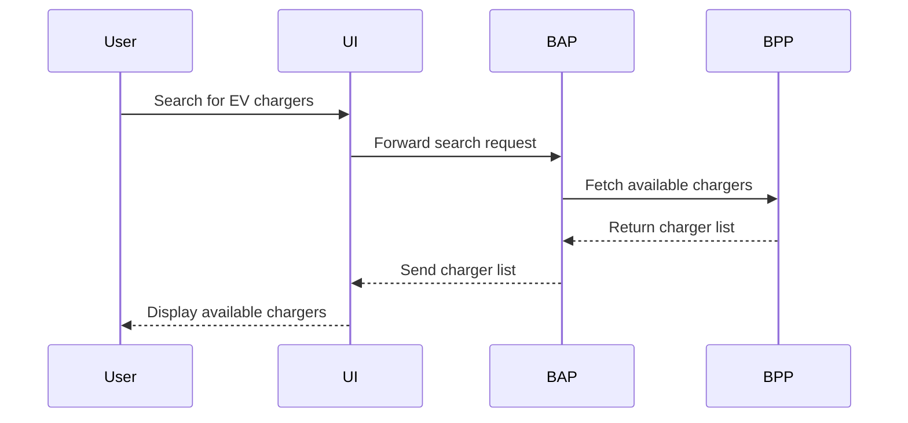
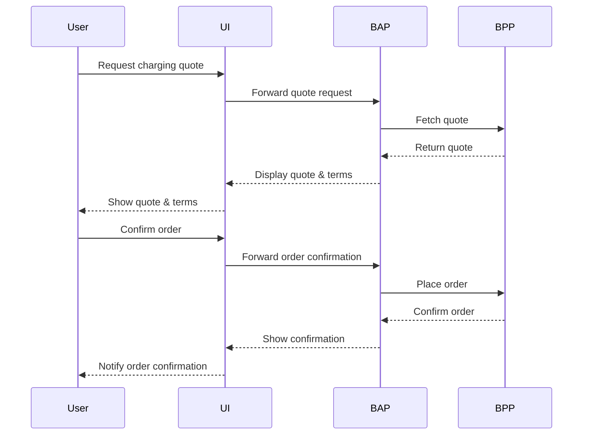
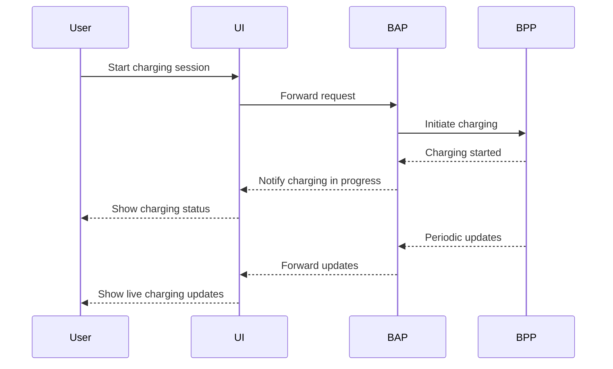
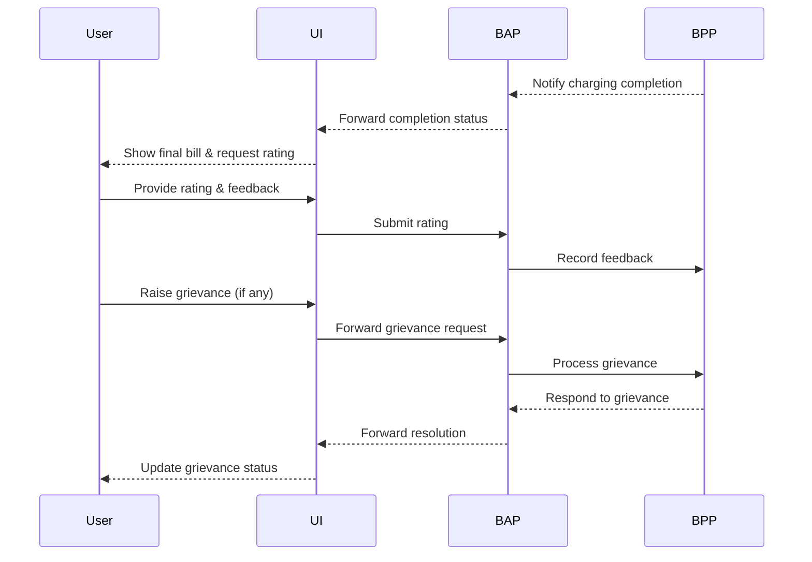

# EV Charging Use Case Document

## Introduction
Electric Vehicle (EV) charging involves multiple workflows, from discovering charging stations to making payments and tracking the charging process. This document provides a structured use case description for developers implementing the **Beckn Protocol** for EV charging, helping them map their workflows to Beckn API calls.

## High-Level Architecture
The EV Charging ecosystem follows an **open network architecture**, divided into multiple layers to ensure interoperability and transparency:

### **Layer Descriptions:**
- **Application Layer (UEI)**: User-facing apps and charging platforms.
- **Transaction Layer (Beckn)**: Standardized interactions between BAP and BPP.
- **Payments Layer**: Handles secure payment processing.
- **Trust Layer**: Ensures identity verification and security.
- **Support Layer**: Customer service and dispute resolution.
- **Real-time Data Streaming Layer**: Provides live updates on charging sessions.

## Use Case Overview
This document covers key interactions between a **consumer** (BAP) and a **charging point operator** (BPP):

- **Discovery of charging sources** (location, charger type, vehicle type, operator, etc.)
- **Placing an order for charging** (time, money, or units)
  - Fetching quote
  - Terms of service (payment, cancellation, refunds)
  - Confirmation (advance, instant, etc.)
- **Fulfillment of a charging order**
  - Status updates
  - Order updates
  - Cancellation
  - Real-time tracking of power delivery
- **Post-charging interactions**
  - Rating
  - Grievance and support
  - Refunds

## 1. Discovery of Charging Stations
A user searches for EV charging stations based on their preferences.

### **Sequence Diagram**

## 2. Placing an Order for Charging
Once a charging station is selected, the user places an order.

### **Sequence Diagram**

## 3. Fulfillment of Charging Order
This includes real-time status updates, tracking, and cancellations.

### **Sequence Diagram**

## 4. Post-Charging Interactions
User can provide feedback, raise grievances, or request refunds.

### **Sequence Diagram**

## API Mapping
To clearly distinguish **Beckn protocol APIs** from other interactions, we use color coding:
- 🟢 **Beckn Protocol APIs (BAP <> BPP)**
- 🔵 **UI Interactions (UI <> BAP, UI <> BPP)**

### Example Mapping for Placing an Order
| Workflow Step | API Endpoint | Type |
|--------------|-------------|------|
| Search charging stations | `search` | 🟢 BAP <> BPP |
| Fetch quote | `select` | 🟢 BAP <> BPP |
| Confirm order | `confirm` | 🟢 BAP <> BPP |
| Order status updates | `track` | 🟢 BAP <> BPP |
| Start charging | UI Action | 🔵 UI <> BAP |
| Provide rating | `rating` | 🟢 BAP <> BPP |
| Raise grievance | `support` | 🟢 BAP <> BPP |

## Conclusion
This document follows an **open network architecture**, ensuring developers implementing **Beckn Protocol** for EV charging can map their business workflows to Beckn API calls effectively.
