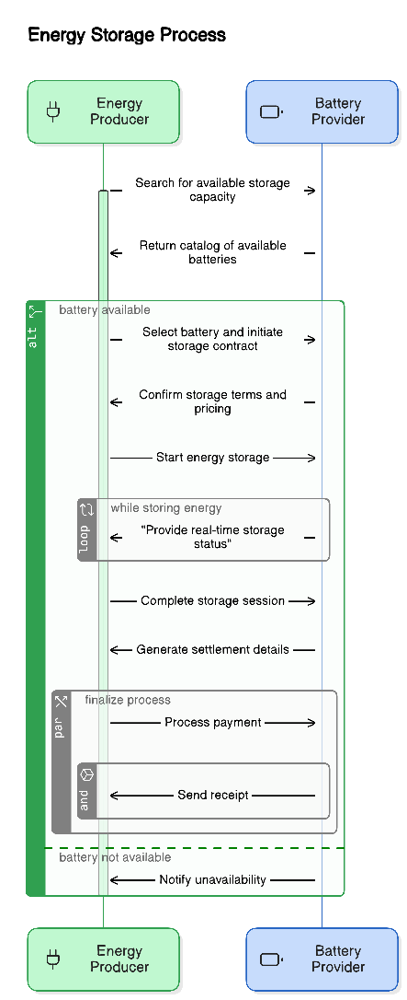

# Microgrid Aggregation Use Case Document

## Table of Contents
1. [Overview](#overview)
2. [Scope](#scope)
3. [Workflow](#workflow)
4. [Digital Functionalities](#digital-functionalities)
5. [Requirements](#requirements)
6. [Implementation Guidelines](#implementation-guidelines)

## Overview
Microgrid aggregation enables the discovery and utilization of distributed energy storage resources (batteries) to store excess energy from energy producers. This creates a more efficient and resilient energy ecosystem by allowing energy producers to store excess energy during peak production periods and retrieve it when needed.

## Scope

### In Scope
- Battery discovery and selection
- Energy storage contract creation
- Real-time monitoring of storage capacity
- Payment and settlement for storage services
- Status tracking and updates
- Support and maintenance

### Out of Scope
- Physical battery installation
- Battery maintenance services
- Grid infrastructure modifications
- Hardware-level integrations

## Workflow

### Process Flow
1. **Discovery Phase**
   - Energy producer searches for available storage capacity
   - Battery providers return catalog of available batteries
   - Producer reviews and selects suitable storage options

2. **Contract Phase**
   - Producer initiates storage contract
   - Provider confirms terms and pricing
   - Contract finalization and activation

3. **Operation Phase**
   - Energy transfer to storage begins
   - Real-time monitoring and status updates
   - Capacity management and optimization

4. **Settlement Phase**
   - Usage calculation and verification
   - Invoice generation
   - Payment processing
   - Reconciliation

### Sequence Diagram

## Digital Functionalities

### 1. Discovery
- Search for available batteries by location
- Filter by storage capacity
- View real-time availability
- Compare pricing models

### 2. Contract Management
- Create storage contracts
- Define storage duration
- Set energy capacity limits
- Specify pricing terms

### 3. Monitoring & Control
- Track storage levels
- Monitor energy flow
- View storage efficiency
- Get status updates

### 4. Payment & Settlement
- Calculate storage costs
- Process payments
- Generate invoices
- Handle reconciliation

### 5. Support Functions
- Report issues
- Request maintenance
- Access documentation
- Contact support

## Requirements

### Functional Requirements

#### 1. Battery Provider Platform (BPP)
- Must implement search endpoint for battery discovery
- Must provide real-time battery status updates
- Must support storage contract creation
- Must handle payment processing
- Must implement monitoring interfaces
- Must provide support endpoints

#### 2. Energy Producer Platform (BAP)
- Must implement battery search functionality
- Must handle contract negotiations
- Must support payment initiation
- Must track storage status
- Must implement error handling
- Must provide user interfaces

#### 3. Integration Requirements
- Must follow Beckn protocol specifications
- Must implement required API endpoints
- Must handle asynchronous callbacks
- Must maintain transaction states
- Must ensure data consistency

### Cross-cutting Requirements

#### 1. Security
- End-to-end encryption for all communications
- Authentication for all API endpoints
- Authorization for sensitive operations
- Secure payment processing
- Data privacy compliance

#### 2. Performance
- Response time < 2 seconds for search operations
- Real-time status updates (< 5 second delay)
- Support for concurrent transactions
- Scalable storage capacity
- High availability (99.9% uptime)

#### 3. Compliance
- Energy sector regulations
- Data protection laws
- Financial transaction rules
- Grid operation standards
- Environmental regulations

#### 4. Integration
- Beckn protocol compatibility
- Standard API implementations
- Event-driven architecture
- Asynchronous communication
- Error handling mechanisms

#### 5. Monitoring
- System health monitoring
- Transaction tracking
- Performance metrics
- Error logging
- Audit trails

## Implementation Guidelines

### API Implementation
- Follow OpenAPI 3.0 specifications
- Implement all required endpoints as per Beckn protocol
- Use standard error codes and responses
- Include proper API documentation

### Technology Stack
- Node.js for backend services
- GitHub Actions for CI/CD
- Standard monitoring tools
- Secure payment gateways

### Best Practices
- Follow RESTful principles
- Implement proper error handling
- Use asynchronous operations where appropriate
- Maintain comprehensive logs
- Regular security audits

### Testing Requirements
- Unit testing for all components
- Integration testing for API endpoints
- Performance testing for scalability
- Security testing for vulnerabilities
- End-to-end testing for workflows